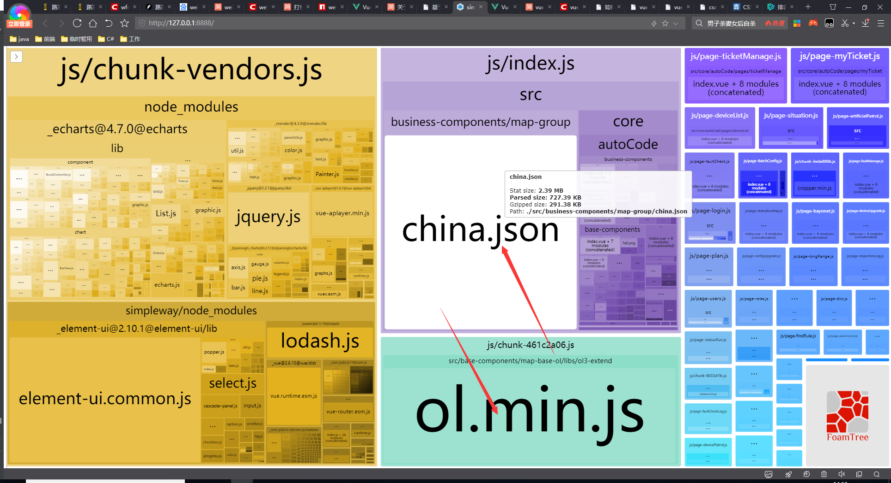

## 2020-11-23 优化打包速度

#### 背景

哨兵PC端项目打包很慢，非常慢，慢得令人发指。所以需要优化下打包速度。。。

#### 步骤一

安装progress-bar-webpack-plugin插件查看打包用时与进度。

```javascript
npm install progress-bar-webpack-plugin chalk -D
```

在vue.config.js中配置progress-bar-webpack-plugin

```javascript
const ProgressBarPlugin = require('progress-bar-webpack-plugin');
const chalk = require('chalk');
module.exports = {
  ...
  configureWebpack: {
    plugins: [
      new ProgressBarPlugin({
        format: ' build [:bar] ' + chalk.green.bold(':percent') + ' (:elapsed seconds)',
        clear: false
      })
    ]
  },
}
```

配置完后运行打包命令npm run build 即可查看打包进度与用时，优化前用时大概300多秒。

#### 步骤二

运行命令查看当前项目打包后各模块的体积，在dist/report.html下查看到优化前的包体积。

```javascript
npm run build --report
```



#### 步骤三

在清楚知道了china.json与ol.min.js体积占比最大的情况下，寻找对应的解决方案。

解决思路为使用webpack.DllPlugin与webpack.DllReferencePlugin，将体积占比较大的模块与外部插件从项目中分离出来

##### webpack.DllPlugin与webpack.DllReferencePlugin概念

DLLPlugin 和 DLLReferencePlugin 用某种方法实现了拆分 bundles，同时还大大提升了构建的速度,将包含大量复用模块且不会频繁更新的库进行编译，只需要编译一次，编译完成后存在指定的文件中。在之后的构建过程中不会再对这些模块进行编译，而是直接使用 DllReferencePlugin 来引用动态链接库的代码。一般会对常用的第三方模块使用这种方式，例如 vue、vue-route、lodash 等。只要这些模块不升级更新，这些动态链接库就不需要重新编译。

#### 步骤四

全局安装webpack与webpack-cli（踩坑：需安装与项目使用的webpack同样版本，webpack版本更新4.0到5.0阶段将webpack.DllPlugin配置入参从array类型更改为object类型，所以需安装与项目使用的webpack同版本）

由于我们目前项目vue-cli脚手架使用的webpack版本为4.28.4，我们全局安装webpack版本为@4.28.4

```javascript
npm install webpack@4.28.4 webpack-cli@3.2.3 -g
npm install webpack-cli@3.2.3 clean-webpack-plugin -D
```

#### 步骤五

新建build文件夹，在文件夹中新建webpack.dll.conf.js，将需要打包进dll中的模块进行配置

```javascript
const path = require('path')
const webpack = require('webpack')
const CleanWebpackPlugin = require('clean-webpack-plugin')
// 由于各项目使用的依赖不同，没有将配置放于simpleWay中，而是将webpack.dll.conf.js放在了项目中进行配置
// 以下配置生成的文件均使用hash，以免出现浏览器缓存现象
module.exports = {
  entry: { // 配置入口
    // 需要提取的库文件，单包文件体积较大时可使用多个分包的形式，配置如下
    vendor: ['vuex', 'jquery', 'countup.js', 'echarts', 'vue-quill-editor'],
    vendor2: [
      './simpleWay/node_modules/element-ui',
      './simpleWay/node_modules/vue-router',
      './simpleWay/node_modules/vue/dist/vue.esm.js'
    ],
    common: [
      './src/base-components/map-base-ol/libs/ol3-extend/ol.min.js',
      './src/base-components/map-base-ol/libs/ol3-extend/transform.js',
      './src/base-components/map-base-ol/libs/ol3-extend/ol-tooltip.js',
      './src/base-components/map-base-ol/libs/ol3-extend/ol_config.js',
      './src/business-components/map-group/china.json'
    ],
  },
  output: { // 配置出口
    path: path.join(__dirname, '../', 'static/dll'),
    filename: '[name]_[hash:6].dll.js',
    // vendor.dll.js中暴露出的全局变量名
    // 保持与 webpack.DllPlugin 中名称一致
    library: '[name]_[hash:6]',
  },
  plugins: [
    // 清除之前的dll文件
    new CleanWebpackPlugin(['*.*'], {
      root: path.join(__dirname, '../', 'static/dll'),
    }),
    // manifest.json 描述动态链接库包含了哪些内容
    new webpack.DllPlugin({
      path: path.join(__dirname, '../', 'static/dll', '[name]_[hash:6]-manifest.json'),
      // 保持与 output.library 中名称一致
      name: '[name]_[hash:6]',
      context: path.resolve(__dirname, '../simpleWay') // 项目上下文
    })
  ]
}
```

做好webpack.dll.conf.js的配置后，运行命令

```javascript
webpack -p --progress --config ./build/webpack.dll.conf.js
```

也可以配置到package.json中,使用npm run build:dll的形式

```javascript
{
  ...
  "scripts": {
    "build:dll": "webpack -p --progress --config ./build/webpack.dll.conf.js",
  },
}

npm run build:dll
```

命令成功运行后，将会在你所配置的出口文件夹中得到对应的dll文件与dll的映射文件，我配置的路径在static/dll下


#### 步骤六

在vue.config.js中引入dll映射文件并配置DllReferencePlugin

```javascript
const manifest = require('./static/vendor2_e75ab7-manifest.json') // 此处只引入了一个映射文件
const webpack = require('webpack')
module.exports = {
  configureWebpack: {
    plugins: [
      new webpack.DllReferencePlugin({
        context: path.resolve(__dirname, './simpleWay'), // 此处指定的上下文是simpleWay，可按所需自行定义
        manifest: manifest // 配置映射文件，webpack打包将忽略映射文件中的打包模块
      })
    ]
  }
}

```

##### 配置好DllReferencePlugin后就是将另外打包的dll.js和我们的web联系起来

直接在index.html引入即可

```javascript
<!DOCTYPE html>
<html>
<head>
</head>
<body>
    <script src="./static/dll/common_e75ab7.dll.js"></script>
    <script src="./static/dll/vendor2_e75ab7.dll.js"></script>
    <script src="./static/dll/vendor2_e75ab7.dll.js"></script>
</body>
</html>

```

运行打包命令后,打包的时间变少了从开始的300秒到60秒左右，依赖包的模块体积也变少了

```javascript
npm run build --report
```


#### 优化步骤

因为dll.js和manifest.json的hash码会在每次运行打包dll命令后都不一样，所以在步骤六中写死了引入文件路径是不优雅的

##### 解决思路

在每次编译启动构建项目时，动态读取对应路径下的dll.js和manifest.json并自动初始化DllReferencePlugin与写入引入文件路径

##### 解决手段

安装add-asset-html-webpack-plugin

```javascript
npm install add-asset-html-webpack-plugin glob -D
```

vue.config.js中添加脚本

```javascript
const path = require('path')
const webpack = require('webpack')
const glob = require("glob")
const AddAssetHtmlPlugin = require('add-asset-html-webpack-plugin')
const manifestFiles = glob.sync('../static/dll/*.json') // 动态获取manifest.json
const dllJsFiles = glob.sync('../static/dll/*.js') // 动态获取dll.js
let DllReferencePluginArr = []
// 自动初始化DllReferencePlugin
manifestFiles.forEach(item => {
  let jsonFilePath = item.substring(item.lastIndexOf('/') + 1)
  DllReferencePluginArr.push(new webpack.DllReferencePlugin({
    context: path.resolve(__dirname, './simpleWay'),
    manifest: require('./static/dll/' + jsonFilePath)
  }))
})
module.exports = {
  ...
  configureWebpack: {
    plugins: [
      ...DllReferencePluginArr,
      // 自动引入dll.js
      new AddAssetHtmlPlugin(dllJsFiles.map(item => {
        let jsFilePath = item.substring(item.lastIndexOf('/') + 1)
        return {
          filepath: path.resolve(__dirname, './static/dll/' + jsFilePath),
          publicPath: './static/dll/', // dll 引用路径
          outputPath: './static/dll/', // dll 引用路径
        }
      })),
    ]
  },
}

```

通过以上脚本处理完后自动初始化DllReferencePlugin与写入引入文件路径就可以完成了
